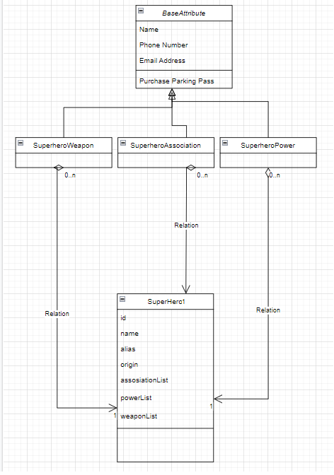
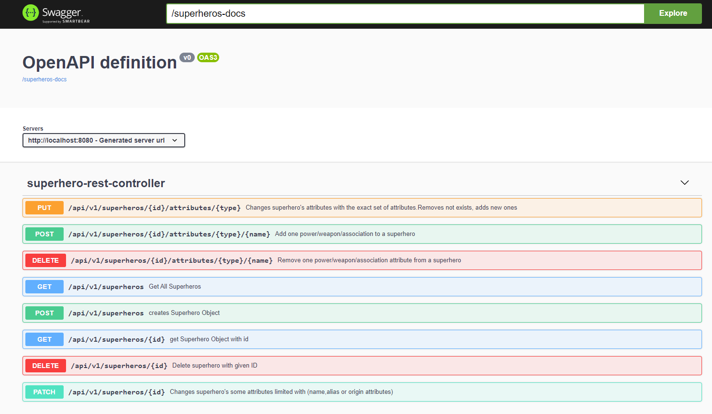

## Environment:
- Java version: 1531522701000
- Maven version: 3.*
- Spring Boot version: 2.2.1.RELEASE

## Description:

To show capabilities:
- Integration Tests are written in the high COVERAGE
- SwaggerUI is added
- Global ExceptionHandling mechanism is added. 
- ConstraintValidator is used in Custom Annotation declaration.
- The superhero attributes like weapon,power and association are designed to be an object List instead of String List.
- Data transfer Objects are used and mapping is used between DTO objects and entities.
- Dta access layer (dao) is added between repository and service layer

## Data:
SwaggerUI : http://localhost:8080/superheros.html

Example of a superhero DTO data JSON object:
```
{
  "alias": "string",
  "name": "string",
  "origin": "string",
  "weaponList": [
    "string"
  ],
  "associationList": [
    "string"
  ],
  "powerList": [
    "string"
  ]
}
```


)


## API Reference:
The REST service must expose the `/api/v1/superheros` API;

**GET** request to `/api/v1/superheros`:

- return a collection of all superheros
- the response code is 200, and the response body is a list of all superheros objects

**GET** request to `/api/v1/superheros/details`:

- return a collection of all superheros with IDs and attributes with IDs
- the response code is 200, and the response body is an list of all superheros objects

**GET** request to `/api/v1/superheros/{id}`:

- returns a superhero with the given id
- if the matching superhero exists, the response code is 200 and the response body is the matching superhero object
- if there is no superhero, the response code is 404


**POST** request to `/api/v1/superheros`:

- creates a new superhero
- expects a JSON superhero object with an id property as a body payload. 
- adds the given superhero object a unique long id. The first created superhero has id 1, 
  the second one 2, and so on.

- The task requires structural and extendable code. So the collections in the superhero
  like weapon,power and association are designed to be an object List instead of String List.
- there is a validation for the attributes: name and alias. They should not be blank.(empty or null)
- the response code is 201, and the response body is the created superhero object

**PATCH** request to `/api/v1/superheros/id`:

- updates partially, name,alias and origin variables. If any of them is left blank it is not updated
- expects a JSON superheroDTO object without an id property as a body payload.
- adds the given superhero object a unique long id. The first created superhero has id 1,
  the second one 2, and so on.

- The task requires structural and extendable code. So the collections in the superhero
  like weapon,power and association are designed to be an object List instead of String List.
- there is a validation for the attributes: name and alias. They should not be blank.(empty or null)
- the response code is 201, and the response body is the created superhero object

**DELETE** request to `/api/v1/superheros/id`:

- deletes superhero.
- expects a long id parameter.
- return status after deleted


**PUT** request to `/api/v1/superheros/{id]/attributes/{type}`:

- changes the attribute lists exactly with the parameter list
- expects a string List. removes the current ones. converts the strings taken as parameters to the object list.
- return superhero DTO object without id properties as a body payload.


**POST** request to `/api/v1/superheros/{id]/attributes/{type}/name`:

- adds an attribute lists exactly with the parameter name
- expects id of superhero, type of attribute and name of attribute
- return superhero DTO object without id properties as a body payload.


**DELETE** request to `/api/v1/superheros/{id]/attributes/{type}/name`:

- removes the attribute given in parameter
- expects id of superhero, type of attribute and name of attribute
- returns status after don removed.


)


## Commands

1- Run integration tests which success %96 code coverage
2- Dockerfile can be used to run program in a container

docker build -t getting-started .
docker run -dp 3000:3000 getting-started
